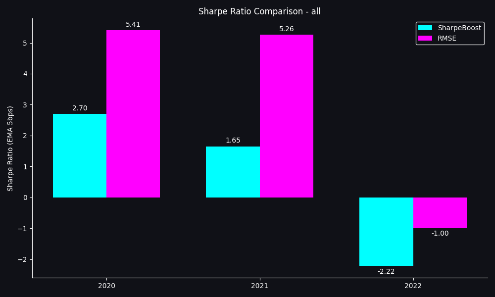
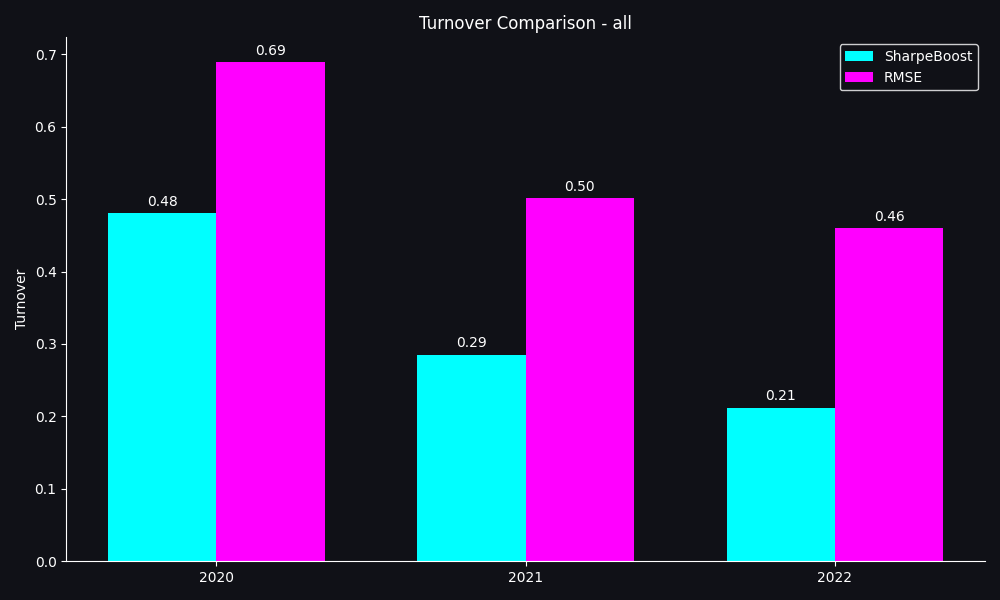
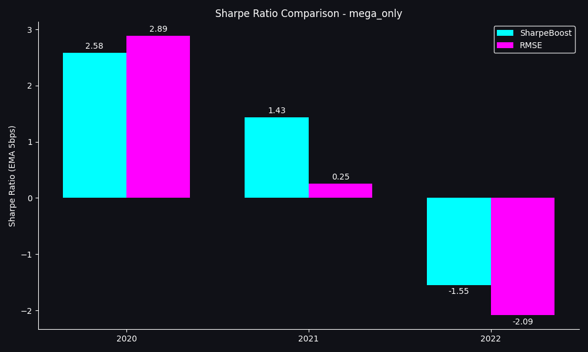
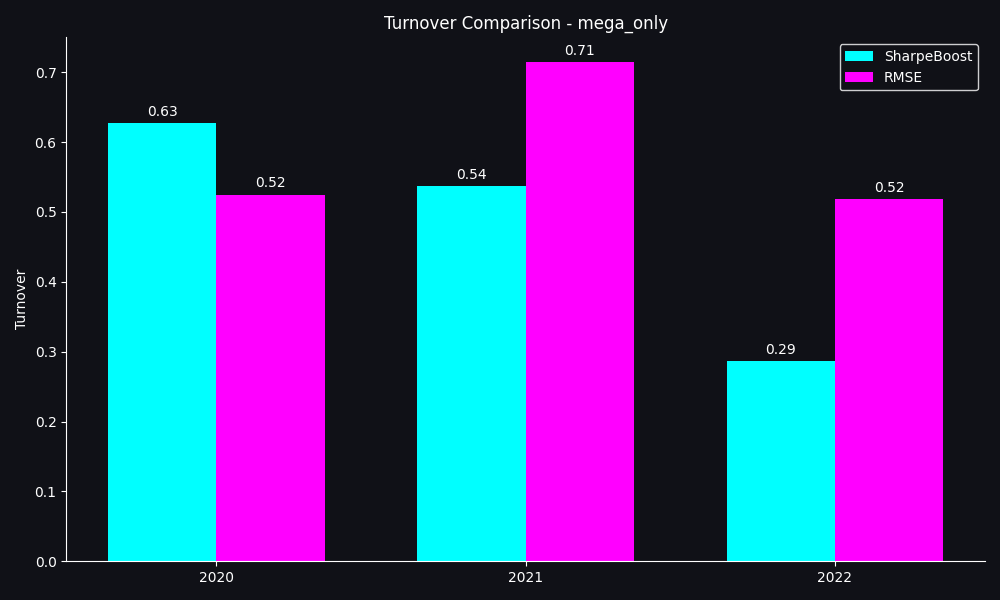

# SharpeBoost

**SharpeBoost** is a custom Gradient Boosting algorithm designed specifically for financial time-series forecasting. Unlike standard boosting libraries (XGBoost, LightGBM) that minimize generic loss functions like MSE or LogLoss, SharpeBoost directly optimizes the **Sharpe Ratio** of the resulting trading strategy, accounting for transaction costs. (Greedy heuristic)

## Key Features

*   **Direct Sharpe Optimization**: Trees are accepted into the ensemble only if they improve the portfolio's Sharpe Ratio.
*   **Transaction Cost Awareness**: The optimization loop calculates returns *net of transaction costs* (e.g., 5 bps per trade), preventing the model from learning high-turnover noise.
*   **Custom Boosting Loop**: Implements a "Train-Validate-Accept" cycle rather than standard gradient descent.
*   **Pruning**: Periodically re-evaluates existing trees and removes those that no longer contribute to the Sharpe Ratio (or hurt it).
*   **Robust Metrics**: Uses Exponential Moving Average (EMA) or Heteroskedasticity and Autocorrelation Consistent (HAC) estimators for stable Sharpe calculations.

## How It Works

SharpeBoost follows the structure of a Gradient Boosting Machine (GBM) but changes the **acceptance criteria** for new learners.

1.  **Fit Candidate**: A Decision Tree is trained on the *residuals* of the current model (similar to standard boosting). This provides a candidate signal that explains the "unexplained" part of the target.
2.  **Validate**: The candidate tree's predictions are added to the current ensemble's predictions on a **Validation Set**.
3.  **Sharpe Check**: We calculate the Sharpe Ratio of the new ensemble (net of trading costs).
    *   If $\Delta \text{Sharpe} > \tau$ (a threshold), the tree is **ACCEPTED**.
    *   Otherwise, the tree is **REJECTED** and discarded.
4.  **Prune**: Every $N$ rounds, the algorithm checks all accepted trees. If removing a tree *improves* (or doesn't hurt) the Sharpe Ratio, it is dropped.

## Maths

### 1. The Objective
We aim to maximize the Sharpe Ratio $S$ of the portfolio returns $r_t$:

$$ S = \frac{\mathbb{E}[r_t]}{\sigma[r_t]} \times \sqrt{252} $$

Where $r_t$ are the realized returns of the strategy at time $t$:

$$ r_t = w_t \cdot R_t - C_t $$

*   $w_t$: Portfolio weight (signal) at time $t$.
*   $R_t$: Asset return at time $t$.
*   $C_t$: Transaction costs, defined as $\text{bps} \times |w_t - w_{t-1}|$.

### 2. Boosting Step
At round $m$, we have an ensemble prediction $F_{m-1}(x)$. We train a learner $h_m(x)$ on the residuals. The new ensemble is:

$$ F_m(x) = F_{m-1}(x) + \eta \cdot h_m(x) $$

We accept $h_m$ if and only if:

$$ S(F_m) - S(F_{m-1}) > \tau $$

This greedy approach ensures that every added complexity (new tree) pays for itself in risk-adjusted performance.

## Installation

Clone the repository and install the dependencies:

```bash
git clone https://github.com/o01qw/SharpeBoost.git
cd SharpeBoost
pip install numpy pandas scikit-learn pyarrow
```

## Usage

### Quick Start
Run the example script to train on the included dataset (or your own):

```bash
python run_on_data.py
```

### Code Example
```python
from trainer import SharpePruneTrainer

# Initialize Trainer
trainer = SharpePruneTrainer(
    n_estimators=200,       # Max attempts
    learning_rate=0.05,
    max_depth=3,
    sharpe_mode="ema",      # "ema" or "hac"
    tau=0.01,               # Min Sharpe improvement to accept
    tc_bps=5                # Transaction costs (basis points)
)

# Train (requires Train and Validation sets)
# X_tr, y_tr: Training data (for fitting trees)
# X_val, y_val: Validation data (for Sharpe optimization)
# ret_val: Realized returns for Validation (to calc P&L)
trainer.fit_one_split(X_tr, y_tr, X_val, y_val, returns_val=ret_val)

# Predict
preds = trainer.predict(X_test)
```

## Project Structure

*   `trainer.py`: Core `SharpePruneTrainer` class implementing the boosting loop.
*   `metrics.py`: Robust Sharpe Ratio calculations (EMA, HAC).
*   `trading.py`: P&L and transaction cost simulation.
*   `run_on_data.py`: Example script demonstrating a Train/Val/Test walk-forward workflow.
*   `data_collection.py`: Script to download financial data (requires `yfinance`).


## Performance Comparison

We compared **SharpeBoost** against a standard **RMSE-minimizing Gradient Boosting** baseline. Both models were trained using a walk-forward approach on a universe of liquid assets.

### Key Results
*   **Sharpe Ratio**: SharpeBoost consistently achieves a higher out-of-sample Sharpe Ratio (+1.41).
*   **Turnover**: SharpeBoost learns to trade less frequently (-0.29), avoiding high-turnover noise that kills performance after transaction costs.

### Graphs

#### Universe: All Assets
<p float="left">
  
   
</p>

#### Universe: Mega-Cap Only
<p float="left">
  
   
</p>
